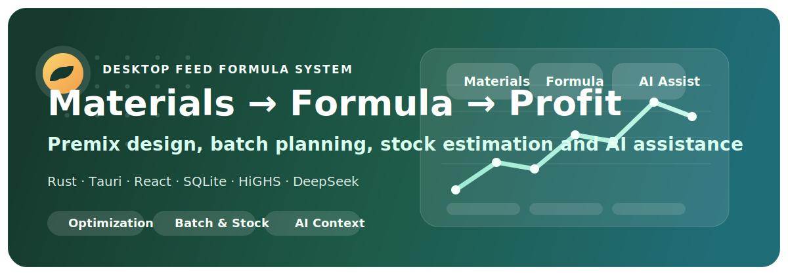
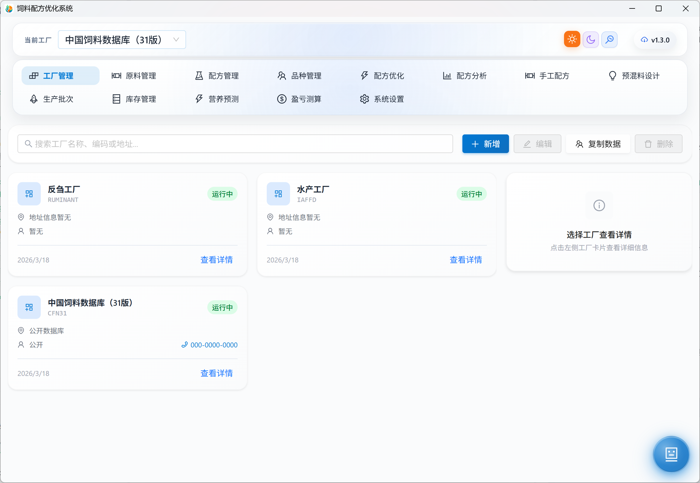
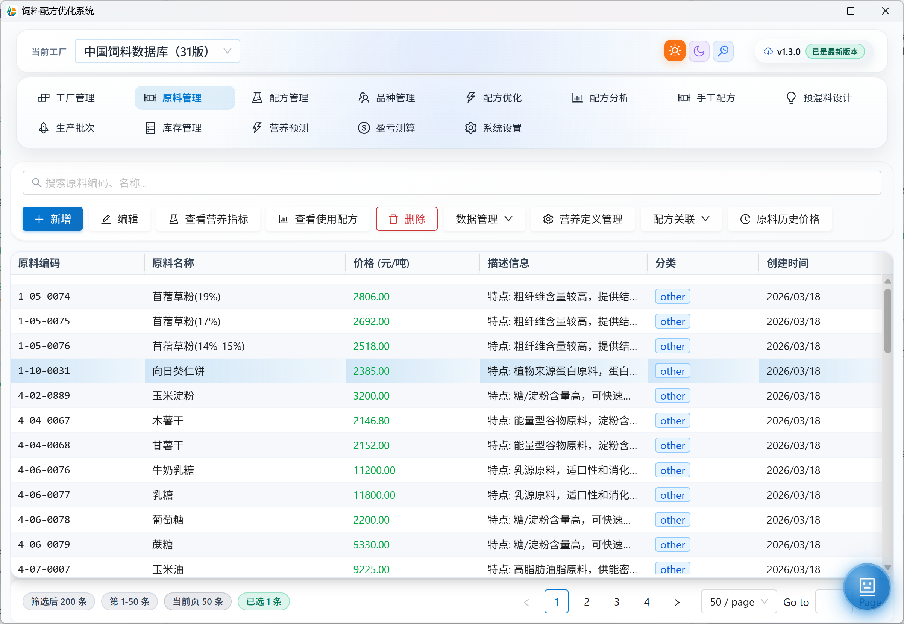
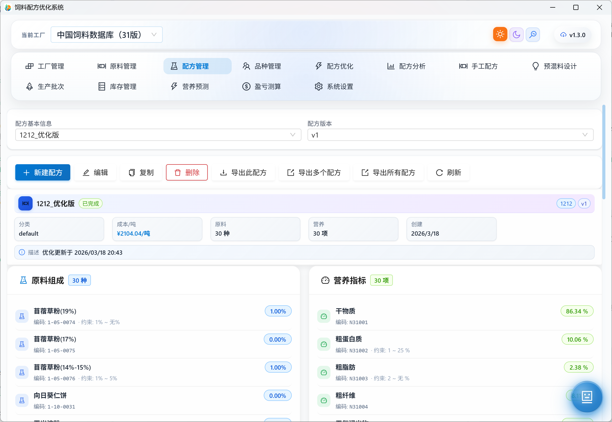
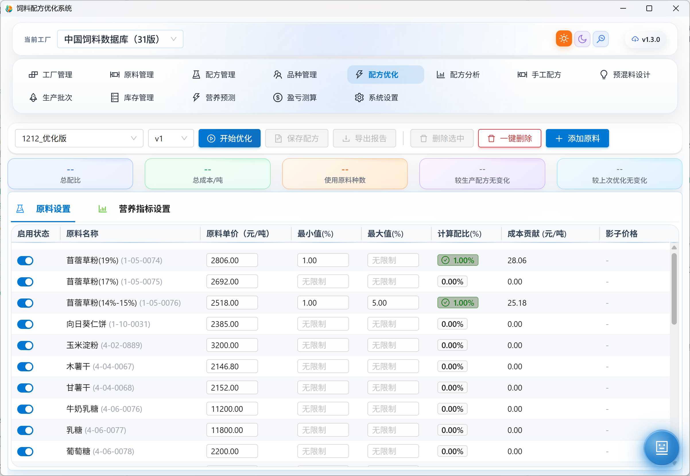
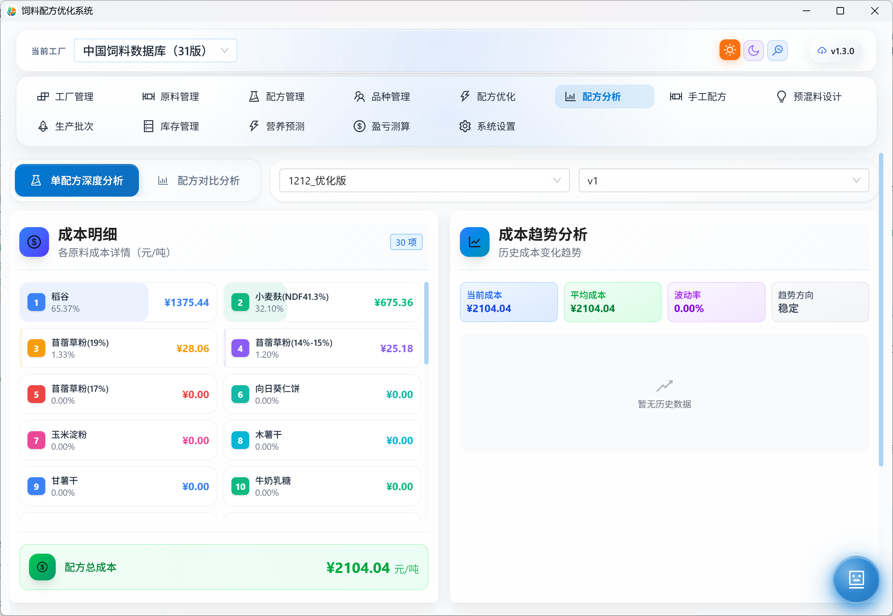
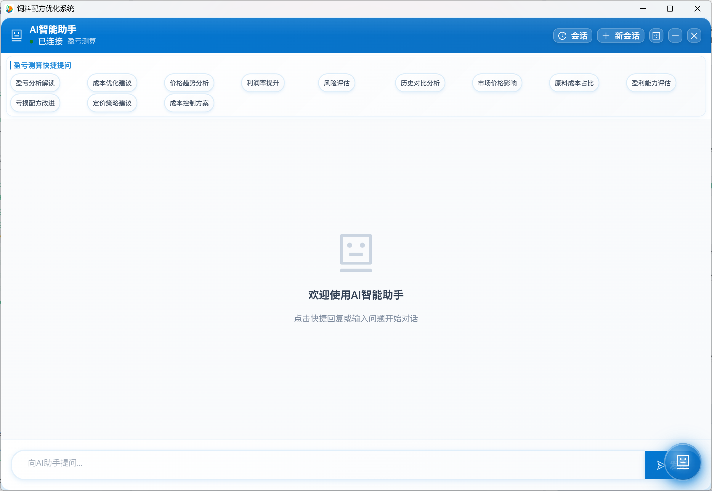
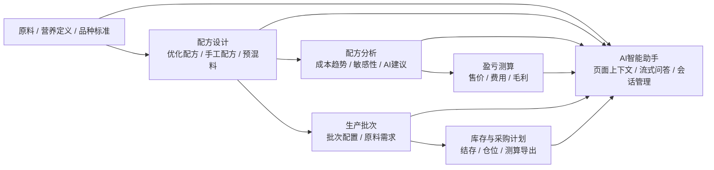

<div align="center">
  
  <h1>CaCrFeedFormula</h1>
  <p><strong>面向配方师、营养师、采购、生产与财务团队的饲料配方优化与经营分析桌面系统</strong></p>
  <p>把原料、营养标准、配方优化、预混料、盈亏、生产批次、库存计划和 AI 问答放进同一套桌面工作台。</p>
  <p>
    <a href="https://github.com/cacr92/cacrfeedformula/releases"></a>
    <a href="https://www.rust-lang.org/"></a>
    <a href="https://react.dev/"></a>
    <a href="https://tauri.app/"></a>
    <a href="https://tauri.app/"></a>
    <a href="https://github.com/cacr92/cacrfeedformula"></a>
  </p>
  <p>
    <a href="https://github.com/cacr92/cacrfeedformula/releases"></a>
    <a href="./docs/饲料配方管理系统使用说明书.md"></a>
    <a href="./CHANGELOG.md"></a>
    <a href="https://github.com/cacr92/cacrfeedformula/issues"></a>
  </p>
</div>

<div align="center">

[快速开始](#快速开始) · [产品展厅](#产品展厅) · [核心能力](#核心能力) · [业务闭环](#业务闭环) · [版本亮点](#版本亮点) · [文档入口](#文档入口) · [开发说明](#开发说明)

</div>

---

## 一眼看懂

<table>
  <tr>
    <td width="25%" valign="top">
      <h3>8 大模块</h3>
      <p>原料、品种、配方、预混料、盈亏、批次、库存、AI 一体化协作。</p>
    </td>
    <td width="25%" valign="top">
      <h3>工业级求解</h3>
      <p>基于 <code>HiGHS 1.12</code> 做线性规划优化，支持复杂约束和结果分析。</p>
    </td>
    <td width="25%" valign="top">
      <h3>桌面端落地</h3>
      <p><code>Rust + Tauri + React</code>，轻量、跨平台、适合企业内部长期使用。</p>
    </td>
    <td width="25%" valign="top">
      <h3>经营闭环</h3>
      <p>不止能算配方，还能串上价格、利润、批次、库存和采购计划。</p>
    </td>
  </tr>
</table>

> CaCrFeedFormula 不是单一的配方求解器，也不是纯录入工具，而是把配方设计、经营分析和生产执行放进同一套工作流里。

## 产品展厅

> 以下为当前版本的真实界面截图，精选 6 张，覆盖从基础数据到优化、分析与 AI 协作的完整工作流。

<div align="center">
  
  <p><strong>工厂总览</strong><br /><sub>从多工厂入口进入整个业务工作台，统一查看工厂状态、模块导航和系统版本。</sub></p>
</div>

<table>
  <tr>
    <td width="50%" valign="top">
      
      <p><strong>原料管理</strong><br /><sub>批量维护原料编码、价格、营养信息与关联关系，配方计算的数据底座一目了然。</sub></p>
    </td>
    <td width="50%" valign="top">
      
      <p><strong>配方管理</strong><br /><sub>集中查看配方版本、原料组成和营养指标，并支持复制、导出和历史追踪。</sub></p>
    </td>
  </tr>
  <tr>
    <td width="50%" valign="top">
      
      <p><strong>配方优化</strong><br /><sub>在同一页面里设置约束、控制成本和求解结果，是产品核心价值最直观的展示。</sub></p>
    </td>
    <td width="50%" valign="top">
      
      <p><strong>配方分析</strong><br /><sub>把成本构成、趋势变化和关键指标拆解成可解释结果，方便复盘与对外汇报。</sub></p>
    </td>
  </tr>
</table>

<div align="center">
  
  <p><strong>AI 智能助手</strong><br /><sub>在当前业务页面直接发起上下文问答，把盈亏、配方和历史数据转成可执行建议。</sub></p>
</div>

## 核心能力

<table>
  <tr>
    <td width="50%" valign="top">
      <h3>配方优化与版本管理</h3>
      <ul>
        <li>成本最小化、多约束优化、成本上限、优化中断</li>
        <li>支持原料上下限、营养上下限、比例关系、固定配比、互斥约束</li>
        <li>优化结果可保存为新配方、新版本或覆盖当前版本</li>
        <li>配方支持历史追踪、比较与批量导出</li>
      </ul>
    </td>
    <td width="50%" valign="top">
      <h3>手工配方与预混料设计</h3>
      <ul>
        <li>手工配比时实时回算营养和成本</li>
        <li>支持预混料反向营养计算、固定原料和添加量预设</li>
        <li>支持从历史配方导入预混料设计数据</li>
        <li>支持根据标签值反推配方与生成计算说明</li>
      </ul>
    </td>
  </tr>
  <tr>
    <td width="50%" valign="top">
      <h3>经营分析与报告输出</h3>
      <ul>
        <li>原料价格历史、Excel 批量导入、配方盈亏测算</li>
        <li>配方深度分析、成本趋势、敏感性分析与 AI 建议</li>
        <li>支持 Excel / PDF 报告导出</li>
        <li>适合定价评估、配方复盘与对外汇报</li>
      </ul>
    </td>
    <td width="50%" valign="top">
      <h3>生产批次、库存与 AI 助手</h3>
      <ul>
        <li>生产批次生命周期管理、配方配载、原料需求计算</li>
        <li>按批次和仓位管理库存结存与采购测算</li>
        <li>DeepSeek 集成，支持页面上下文感知和流式回复</li>
        <li>多工厂隔离、数据复制、自动更新与系统路径管理</li>
      </ul>
    </td>
  </tr>
</table>

## 业务闭环



## 版本亮点

### v1.3.0 这轮重点在什么

- AI 智能助手增强了页面上下文、流式失败恢复、会话摘要增量压缩和长对话稳定性。
- 配方优化新增成本上限约束和优化中断能力，异常场景处理更完整。
- 批量导出增强，支持多配方 PDF 导出，报告链路更顺手。
- 缓存、数据库索引初始化、历史查询与大表读写持续优化。
- 前后端补充了大量集成、性能、回归和边界测试，降低迭代回归风险。

<details>
  <summary><strong>查看完整更新日志</strong></summary>

  详细版本记录见 [CHANGELOG.md](./CHANGELOG.md)。

</details>

## 快速开始

<table>
  <tr>
    <td width="50%" valign="top">
      <h3>方式一：直接下载安装</h3>
      <ol>
        <li>打开 <a href="https://github.com/cacr92/cacrfeedformula/releases">Releases</a> 下载对应平台安装包。</li>
        <li>首次启动后，应用会自动初始化本地数据目录与数据库。</li>
        <li>进入“系统设置”完成基础偏好配置。</li>
        <li>如需 AI 能力，补充 DeepSeek API 信息即可开始使用。</li>
      </ol>
    </td>
    <td width="50%" valign="top">
      <h3>方式二：从源码运行</h3>

<pre lang="bash"><code>cd frontend
npm install
npm run dev</code></pre>

在另一个终端中运行：

<pre lang="bash"><code>cd frontend
npm run tauri:dev</code></pre>

    </td>
  </tr>
</table>

<details>
  <summary><strong>展开查看完整质量检查命令</strong></summary>

```bash
# Rust
cargo fmt --all
cargo clippy --all-targets --all-features -- -D warnings
cargo test

# Frontend
cd frontend && npm run lint
cd frontend && npx tsc --noEmit -p tsconfig.app.json
cd frontend && npm run test
cd frontend && npm run build
```

</details>

<details>
  <summary><strong>展开查看绑定生成命令</strong></summary>

```bash
cargo run --bin generate_bindings
```

</details>

## 文档入口

| 文档 | 说明 |
| --- | --- |
| [docs/饲料配方管理系统使用说明书.md](./docs/饲料配方管理系统使用说明书.md) | 面向业务用户的完整使用说明 |
| [docs/饲料配方管理系统使用说明书.pdf](./docs/饲料配方管理系统使用说明书.pdf) | 适合离线分发的 PDF 版说明书 |
| [CHANGELOG.md](./CHANGELOG.md) | 版本迭代记录与近期变更明细 |

## 数据说明

> 初始化迁移已包含基于《中国饲料数据库》第 31 版整理的基础数据，适合快速启动和功能体验。实际生产使用前，请务必结合本地原料、工艺和业务目标自行校验。

<details>
  <summary><strong>展开查看用户数据目录</strong></summary>

| 平台 | 默认目录 |
| --- | --- |
| macOS | `~/Library/Application Support/com.cacr92.cacrfeedformula/` |
| Windows | `%APPDATA%\\com.cacr92.cacrfeedformula\\` |
| Linux | `~/.local/share/com.cacr92.cacrfeedformula/` |

</details>

## 技术栈

| 层级 | 技术 |
| --- | --- |
| 桌面容器 | `Tauri 2.9` |
| 后端 | `Rust 2021`、`Tokio 1.37`、`SQLx 0.7`、`SQLite`、`HiGHS 1.12`、`tracing` |
| 前端 | `React 19.1`、`TypeScript 5.8`、`Ant Design 5.26`、`Tailwind CSS 4.1`、`TanStack Query`、`Recharts` |
| 类型绑定 | `Specta`、`tauri-specta` |
| 构建与测试 | `Vite 7`、`Vitest 4`、`ESLint 9`、`cargo test` |

## 开发说明

<details>
  <summary><strong>展开查看仓库结构与协作约束</strong></summary>

### 仓库结构

```text
.
├─ src/                        Rust 核心业务与 Tauri 命令
│  ├─ formula/                 配方优化、手工配方、分析与报告
│  ├─ material/                原料、营养定义、库存与导入导出
│  ├─ species/                 品种、阶段、营养标准
│  ├─ premix/                  预混料设计与计算
│  ├─ profit/                  盈亏测算与价格历史
│  ├─ production_batch/        生产批次与原料需求
│  ├─ prediction/              营养预测
│  └─ ai/                      AI 对话、配置、上下文与会话压缩
├─ frontend/src/               React 页面与组件
├─ migrations/                 系统基础迁移与共享 schema
├─ personaldata/               业务预置 SQL 数据
├─ docs/                       使用说明和补充文档
├─ config/                     应用配置模板
└─ src/bin/generate_bindings.rs
                              Specta 类型绑定生成入口
```

### 开发者注意事项

- 前端统一通过 `frontend/src/bindings.ts` 中的 `commands` 调用后端，不要手写原始 `invoke`。
- 新增或修改 Tauri 命令后，除了生成绑定，还要同步检查 `capabilities/default.json` 的权限配置。
- 这个仓库前后端测试覆盖较完整，包含单元、集成、回归、性能和工作流测试，建议改动后至少跑一轮相关自动化检查。

</details>

## 适用角色

| 角色 | 典型使用方式 |
| --- | --- |
| 配方师 / 营养师 | 维护营养标准、设计手工配方、运行优化、分析结果 |
| 采购 | 更新价格、查看原料历史、输出采购测算 |
| 生产管理 | 创建生产批次、核对原料需求、跟踪库存与结存 |
| 财务 / 经营管理 | 查看配方盈亏、比较价格变化、辅助定价决策 |
| 系统管理员 | 维护工厂、配置路径、管理升级与基础数据 |

## 支持与反馈

<div align="center">
  <a href="https://github.com/cacr92/cacrfeedformula/issues"></a>
  <a href="https://github.com/cacr92/cacrfeedformula/discussions"></a>
  <a href="mailto:153687017@qq.com"></a>
</div>

## 许可证

项目在仓库元数据中声明为 `MIT` 许可证。

---

<div align="center">
  如果这个项目对你有帮助，欢迎在 GitHub 上点一个 Star。
</div>
