# 饲料配方管理系统使用说明书

> 培训手册版  
> 版本：v1.3.1  
> 更新日期：2026-03-31  
> 适用对象：营养师、配方师、采购人员、生产管理人员、财务人员、系统管理员  
> 使用目标：让新用户看完后能按业务顺序独立完成“基础数据准备 -> 配方设计/优化 -> 分析测算 -> 生产批次 -> 库存采购”的完整工作。

---

## 目录

1. 先看这页：新用户怎么学最快
2. 系统全景与关键概念
3. 一条完整业务流程
4. 按菜单逐页培训
5. 常见问题与排障建议
6. 培训建议与考核方式
7. 结语

---

## 1. 先看这页：新用户怎么学最快

### 1.1 这份手册怎么用

这份手册不是单纯的功能清单，而是按“培训上手”的思路来写，建议这样使用：

1. 第一次接触系统，先看“15 分钟快速上手”和“完整业务流程”。
2. 已经知道自己要做什么，直接按菜单去看对应章节。
3. 培训新人时，先讲“为什么要先维护工厂、原料、品种”，再讲配方、分析、生产和库存。

### 1.2 新用户 15 分钟快速上手

如果你只有 15 分钟，建议按下面顺序快速建立认知：

1. 打开系统后，先理解左侧菜单、顶部当前工厂、右下角 AI 助手三个位置各自负责什么。
2. 进入“工厂管理”，知道系统是按工厂隔离数据的。
3. 进入“原料管理”，理解原料、营养定义、价格是后续所有模块的基础。
4. 进入“品种管理”，理解品种、生长阶段、营养标准是配方约束来源。
5. 进入“配方管理”，知道配方是“配方号 + 版本”的组合。
6. 进入“配方优化”或“手工配方”，体验一次配方生成过程。
7. 进入“配方分析”和“盈亏测算”，理解“营养合理”不等于“经营上赚钱”。
8. 最后进入“生产批次”和“库存管理”，理解系统如何把研发结果落到生产与采购。

### 1.3 第一次使用前的检查清单

首次启用系统时，建议管理员按这个顺序完成准备：

1. 新建或确认当前工厂。
2. 打开“系统设置”，确认小数位数、PDF 导出字体、数据目录可正常使用。
3. 如果要使用 AI，先在“系统设置”中配置服务商、API 密钥、模型并测试连接。
4. 导入或维护原料基础信息、营养值、原料价格。
5. 导入或维护品种、生长阶段、营养标准。
6. 导入或建立配方库。
7. 让业务人员从“配方优化 / 手工配方 / 预混料设计 / 配方分析 / 盈亏测算”开始工作。

### 1.4 按角色推荐阅读路径

| 角色 | 建议先看 | 重点目标 |
| --- | --- | --- |
| 系统管理员 | 工厂管理、系统设置与更新、原料管理 | 建好数据底座，保证编码、目录、AI、导入模板可用 |
| 营养师 / 配方师 | 原料管理、品种管理、配方管理、配方优化、手工配方、配方分析 | 会做新配方、会做版本迭代、会读分析结果 |
| 采购人员 | 原料管理、库存管理、盈亏测算 | 会更新原料价格、看采购量、判断成本风险 |
| 生产人员 | 生产批次、库存管理 | 会按版本创建批次、导出耗料、记录库存差异 |
| 财务 / 经营人员 | 盈亏测算、配方分析 | 会看利润率、追溯成本变化、定位亏损原因 |
| 管理层 | 系统全景、完整业务流程、AI 智能助手 | 快速理解系统如何支撑经营决策 |

---

## 2. 系统全景与关键概念

### 2.1 系统界面总览

> 截图解读：左侧是主菜单，中间是当前页面工作区，顶部包含当前工厂、主题切换和版本更新入口。培训新人时，第一句一定要强调“先看当前工厂，再开始做业务”。

### 2.2 系统到底帮你解决什么问题

这套系统不是单一的“配方计算器”，而是把以下工作放在一条连续链路里：

1. 建立工厂、原料、营养定义、品种和标准。
2. 创建、复制、优化和分析配方。
3. 计算配方成本、利润率和经营结果。
4. 生成生产批次、核对库存、测算采购量。
5. 用 AI 辅助解释结果、排查异常、形成复盘结论。

### 2.3 必须先理解的 6 个关键概念

#### 1. 当前工厂决定你看到的业务数据

原料、品种、配方、批次、库存、盈亏数据都依赖当前工厂。  
如果页面是空的、导入后找不到数据、分析结果对不上，先检查顶部当前工厂。

#### 2. 营养定义是全系统共用字典

原料营养值、品种营养标准、配方约束、营养预测写回都依赖营养定义。  
如果编码、名称、单位维护不统一，后续会出现“匹配不上”“无法推荐”“无法写回”的问题。

#### 3. 配方不是一条记录，而是一组版本

系统里的很多场景都不仅要选配方号，还要选版本。  
尤其是配方优化、配方分析、生产批次、盈亏测算和导出时，版本选择会直接影响结果。

#### 4. 原料价格会影响优化、分析和盈亏

更新原料价格后，配方成本、利润率、可替代策略都可能变化。  
推荐养成“更新价格 -> 复核配方 -> 再看盈亏”的习惯。

#### 5. 库存管理其实包含两条线

库存管理模块同时承担：

1. 批次库存核对：看理论需求、领用、实际投料、剩余差异。
2. 仓位采购测算：看仓位库存、月用量、标准库存天数和需采购量。

#### 6. AI 助手最适合做“解释”和“辅助判断”

AI 最适合回答：

1. 配方优化为什么无解。
2. 新旧版本差在哪。
3. 哪些原料最影响成本。
4. 当前批次差异为什么偏大。
5. 哪些费用正在拖低利润率。

### 2.4 菜单速览

| 菜单 / 功能 | 你主要在这里做什么 | 典型输出 |
| --- | --- | --- |
| 工厂管理 | 建工厂、编辑工厂、复制工厂数据 | 新工厂可直接使用 |
| 原料管理 | 管原料、营养、价格、规则、关联 | 原料数据库、价格基础、营养字典 |
| 配方管理 | 建配方、查版本、导出 | 配方库与版本台账 |
| 品种管理 | 管品种、生长阶段、营养标准 | 配方约束依据 |
| 配方优化 | 自动求解更优配方 | 新版本或新配方 |
| 配方分析 | 看单配方、比两个版本 | 分析报告、差异结论 |
| 手工配方 | 经验调配或试验性配方设计 | 手工方案、复合原料 |
| 预混料设计 | 设计预混料并生成推荐配方 | 预混料方案、推荐全价料 |
| 生产批次 | 按配方版本生成生产任务 | 批次单、原料需求 |
| 库存管理 | 记录批次耗料和采购测算 | 库存差异、采购清单 |
| 营养预测 | 预测能量值并写回原料 | 更新后的原料营养值 |
| 盈亏测算 | 看成本、费用、净价、毛利和利润率 | 盈亏表、历史记录 |
| 系统设置 | 管显示规则、PDF 字体、AI、目录 | 稳定的使用环境 |
| AI 智能助手 | 全局解释、诊断、建议 | 业务说明、排障思路 |

---

## 3. 一条完整业务流程

### 3.1 先记住这张流程图

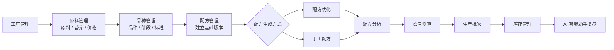
```mermaid
flowchart LR
    A["工厂管理"] --> B["原料管理<br/>原料 / 营养 / 价格"]
    B --> C["品种管理<br/>品种 / 阶段 / 标准"]
    C --> D["配方管理<br/>建立基础版本"]
    D --> E{"配方生成方式"}
    E --> F["配方优化"]
    E --> G["手工配方"]
    F --> H["配方分析"]
    G --> H
    H --> I["盈亏测算"]
    I --> J["生产批次"]
    J --> K["库存管理"]
    K --> L["AI 智能助手复盘"]
```

如果是新工厂上线，先做左边；如果是老工厂日常迭代，通常从“原料价格更新”或“现有配方优化”开始。

### 3.2 业务流程一：新工厂启用

#### 适用场景

1. 新建分厂或新事业部。
2. 需要把老工厂已有数据复制到新工厂。
3. 同一套业务逻辑要在多个工厂独立运行。

#### 流程图

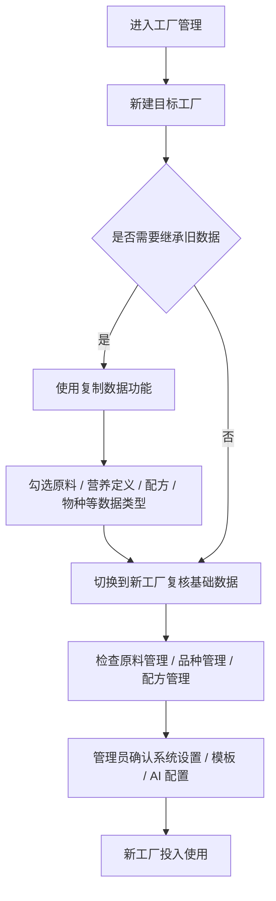
```mermaid
flowchart TD
    A["进入工厂管理"] --> B["新建目标工厂"]
    B --> C{"是否需要继承旧数据"}
    C -- "是" --> D["使用复制数据功能"]
    D --> E["勾选原料 / 营养定义 / 配方 / 物种等数据类型"]
    E --> F["切换到新工厂复核基础数据"]
    C -- "否" --> F
    F --> G["检查原料管理 / 品种管理 / 配方管理"]
    G --> H["管理员确认系统设置 / 模板 / AI 配置"]
    H --> I["新工厂投入使用"]
```

#### 标准流程

1. 进入“工厂管理”，新建目标工厂。
2. 如果希望继承现有数据，使用“复制数据”功能选择源工厂和目标工厂。
3. 勾选要复制的数据类型，常见包括原料、营养定义、配方、物种。
4. 复制完成后，切换到新工厂检查原料管理、品种管理、配方管理是否完整。
5. 再由管理员确认系统设置、导入模板、AI 配置是否就绪。

#### 培训提醒

1. 复制工厂数据前先确认是否允许覆盖目标工厂已有数据。
2. 如果复制了原料，建议同时复制相关营养定义，避免后续匹配失败。

### 3.3 业务流程二：从基础数据到新配方开发

#### 适用场景

1. 新产品立项。
2. 新阶段配方开发。
3. 配方库还没有目标配方，需要从零开始建立。

#### 流程图

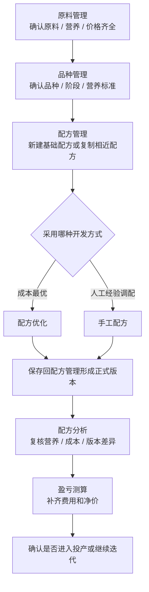
```mermaid
flowchart TD
    A["原料管理<br/>确认原料 / 营养 / 价格齐全"] --> B["品种管理<br/>确认品种 / 阶段 / 营养标准"]
    B --> C["配方管理<br/>新建基础配方或复制相近配方"]
    C --> D{"采用哪种开发方式"}
    D -- "成本最优" --> E["配方优化"]
    D -- "人工经验调配" --> F["手工配方"]
    E --> G["保存回配方管理形成正式版本"]
    F --> G
    G --> H["配方分析<br/>复核营养 / 成本 / 版本差异"]
    H --> I["盈亏测算<br/>补齐费用和净价"]
    I --> J["确认是否进入投产或继续迭代"]
```

#### 标准流程

1. 在“原料管理”确认原料基础信息、营养值和价格齐全。
2. 在“品种管理”确认目标品种、生长阶段和营养标准已维护。
3. 在“配方管理”新建一个基础配方，或者复制相近配方作为起点。
4. 若以成本最优为目标，进入“配方优化”求解。
5. 若需要人工经验调配，进入“手工配方”调整。
6. 将结果保存回“配方管理”形成正式版本。
7. 用“配方分析”检查营养、成本和版本差异。
8. 用“盈亏测算”补齐费用和净价，确认业务可行性。

### 3.4 业务流程三：现有配方降本优化

#### 适用场景

1. 原料价格上涨，需要降本。
2. 某种原料缺货，需要寻找替代方案。
3. 已有成熟配方，希望做“保守优化版”或“低成本版”。

#### 标准流程

1. 在“原料管理”先更新原料价格。
2. 进入“配方优化”，选中目标配方和目标版本。
3. 导入标准或复核当前约束。
4. 设置原料上下限和营养约束。
5. 开始优化，查看新旧成本差异、营养变化和求解状态。
6. 如果结果可用，保存为新版本，不建议直接覆盖生产中版本。
7. 用“配方分析”比对新旧版本，再到“盈亏测算”看利润变化。

### 3.5 业务流程四：预混料设计到推荐配方

#### 适用场景

1. 设计维生素预混料、微量元素预混料或复合预混料。
2. 需要根据标签值或设计目标反推配方。
3. 想看预混料对全价料方案的影响。

#### 标准流程

1. 进入“预混料设计”，选择从零开始或从已有配方导入。
2. 设定添加量并准备营养目标。
3. 添加原料，必要时把部分原料设为固定配比。
4. 系统计算配比、营养贡献和成本。
5. 如果只有标签值，可使用“标签反推”。
6. 使用“生成推荐配方”查看对应全价料方案。
7. 将结果保存为预混料配方、保存为原料，或导出报告。

### 3.6 业务流程五：生产执行与库存采购

#### 适用场景

1. 已经确定要投产某个配方版本。
2. 需要汇总某个批次的原料需求。
3. 需要按仓位测算采购量。

#### 标准流程

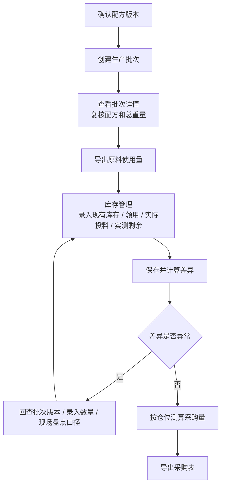
```mermaid
flowchart TD
    A["确认配方版本"] --> B["创建生产批次"]
    B --> C["查看批次详情<br/>复核配方和总重量"]
    C --> D["导出原料使用量"]
    D --> E["库存管理<br/>录入现有库存 / 领用 / 实际投料 / 实测剩余"]
    E --> F["保存并计算差异"]
    F --> G{"差异是否异常"}
    G -- "是" --> H["回查批次版本 / 录入数量 / 现场盘点口径"]
    H --> E
    G -- "否" --> I["按仓位测算采购量"]
    I --> J["导出采购表"]
```

#### 培训提醒

1. 创建生产批次时，最容易出错的是选错配方版本。
2. 做采购测算前，先完成“原料仓位设置”和“保存并计算”。

### 3.7 业务流程六：营养预测回填原料

#### 适用场景

1. 实验室能量值还没有回传，但业务需要先做估算。
2. 新原料刚录入，想先建立预测值。
3. 想用新的预测结果更新原料营养数据库。

#### 标准流程

1. 进入“营养预测”，选择已有原料或新建原料模式。
2. 选择动物类别并检查营养指标映射。
3. 输入营养值，开始预测。
4. 选择保存平均值或某个公式结果。
5. 选择覆盖原料或另存为新原料。

### 3.8 业务流程七：用 AI 做结果解释和培训复盘

#### 适用场景

1. 新人看不懂某个页面结果。
2. 配方优化失败，需要快速定位原因。
3. 经营人员想把分析结论转成可读说明。

#### 标准流程

1. 先选好当前工厂。
2. 在业务页面中选中具体对象，比如原料、配方、版本、批次。
3. 打开右下角 AI 助手。
4. 优先用快捷提问，或者直接输入自然语言问题。
5. 用 AI 给出的结论做第一轮判断，再回到业务页面核实。

---

## 4. 按菜单逐页培训

这一章适合“边看页面边培训”。  
每一节都按“适用场景 -> 页面重点 -> 如何使用 -> 常见提醒”的顺序来讲。

### 4.1 工厂管理

> 截图解读：工厂管理不只是建一条工厂记录，更重要的是确定业务数据边界。顶部当前工厂切换会影响后续所有业务模块。

#### 快速流程图

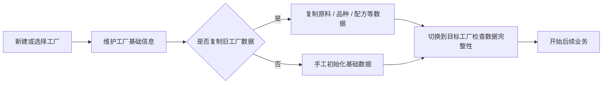
```mermaid
flowchart LR
    A["新建或选择工厂"] --> B["维护工厂基础信息"]
    B --> C{"是否复制旧工厂数据"}
    C -- "是" --> D["复制原料 / 品种 / 配方等数据"]
    C -- "否" --> E["手工初始化基础数据"]
    D --> F["切换到目标工厂检查数据完整性"]
    E --> F
    F --> G["开始后续业务"]
```

#### 适用场景

1. 第一次启用系统。
2. 新建分厂、代工厂、试验工厂。
3. 需要复制现有工厂的原料、品种或配方。

#### 页面重点

1. 工厂列表与搜索。
2. 新建 / 编辑工厂。
3. 工厂数据复制。
4. 删除工厂前的关联检查。

#### 如何使用

1. 先看当前是否已有工厂，没有就新建。
2. 新建时填写工厂名称、代码及必要说明。
3. 如果新工厂要沿用旧工厂数据，使用“复制数据”。
4. 复制后切换到目标工厂逐页检查原料、品种和配方。
5. 只有确认没有关联数据时，才执行删除。

#### 常见提醒

1. 工厂是数据边界，不同工厂下的数据默认彼此独立。
2. 删除工厂前必须确认没有关联配方、手工配方或其他业务数据。

### 4.2 原料管理

> 截图解读：原料管理通常是新人培训最重要的页面。这里不仅维护原料本身，还维护价格、营养定义、规则和配方关联，是整个系统的数据底座。

#### 快速流程图

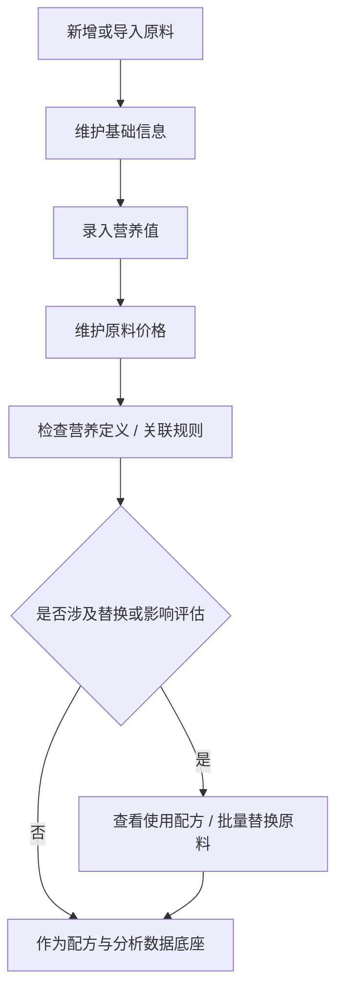
```mermaid
flowchart TD
    A["新增或导入原料"] --> B["维护基础信息"]
    B --> C["录入营养值"]
    C --> D["维护原料价格"]
    D --> E["检查营养定义 / 关联规则"]
    E --> F{"是否涉及替换或影响评估"}
    F -- "是" --> G["查看使用配方 / 批量替换原料"]
    F -- "否" --> H["作为配方与分析数据底座"]
    G --> H
```

#### 适用场景

1. 新工厂导入基础原料数据。
2. 采购更新价格。
3. 营养师维护营养值、营养定义和配方关联。
4. 配方师想知道某个原料影响了哪些配方。

#### 页面重点

1. 原料基础信息与营养值。
2. 原料价格与价格历史。
3. 查看使用配方与批量替换原料。
4. 营养定义管理。
5. 营养关联规则与公式规则。
6. 配方关联管理。

#### A. 原料基础信息与营养值

##### 适用场景

1. 新增原料。
2. 修改营养值。
3. 批量导入原料基础信息。

##### 如何使用

1. 先确认当前工厂。
2. 新增或编辑原料时，维护编码、名称、分类、描述等基础信息。
3. 在营养值区域录入或导入各项营养指标。
4. 保存后抽查关键原料是否已正确显示营养数据。

##### 培训提醒

1. 原料编码要统一，不要同一原料出现多个叫法。
2. 营养值缺失会直接影响配方优化、分析和预测结果。

#### B. 原料价格管理

##### 适用场景

1. 采购定期更新价格。
2. 想追溯某个原料最近价格变化。
3. 要判断配方成本为什么突然波动。

##### 如何使用

1. 在原料列表中维护单价，或用导入功能批量更新。
2. 导入后查看结果统计，确认成功行数和失败行数。
3. 如需回溯变化，打开价格历史查看记录。
4. 更新价格后，建议立刻去“配方分析”或“盈亏测算”复核影响。

##### 培训提醒

1. 价格一更新，成本相关结果都会跟着变。
2. 建议培训采购人员养成“先更新价格，再通知营养师复核配方”的习惯。

#### C. 查看使用配方与批量替换原料

##### 适用场景

1. 某原料停售或涨价，需要找受影响配方。
2. 想把一批配方中的某原料统一替换成新原料。

##### 如何使用

1. 选中目标原料。
2. 查看当前有哪些配方、哪些版本正在使用它。
3. 先评估替换影响，再执行批量替换。
4. 替换后到“配方分析”抽查重点配方是否仍合理。

##### 培训提醒

1. 批量替换前最好先留档或导出受影响配方清单。
2. 替换后不要跳过分析环节。

#### D. 营养定义管理

##### 适用场景

1. 新增系统内还没有的营养指标。
2. 统一营养指标编码、名称、单位。
3. 处理导入和分析时的字段映射问题。

##### 如何使用

1. 为每个营养指标维护编码、名称、单位、分类。
2. 确保原料管理、品种管理、预测映射用的是同一套定义。
3. 修改定义后，抽查下游页面是否仍能正确显示。

##### 培训提醒

1. 这是全系统“字典表”，不要随意改编码。
2. 如果必须改，先确认不会影响已有原料和配方数据。

#### E. 营养关联规则与公式规则

##### 适用场景

1. 某些营养值之间存在自动换算关系。
2. 需要让系统根据规则辅助补全或解释指标。

##### 如何使用

1. 进入规则区域，维护关联关系或公式。
2. 保存后，回到原料或分析页面验证结果是否符合预期。

##### 培训提醒

1. 规则是高影响配置，建议由管理员或资深营养师统一维护。
2. 修改规则后要做抽样验证，避免全局结果偏差。

#### F. 配方关联管理

##### 适用场景

1. 想了解某原料与哪些配方强相关。
2. 需要为后续分析或 AI 提供更完整的关联信息。

##### 如何使用

1. 进入配方关联管理，查看或维护原料与配方的对应关系。
2. 如有批量导入需求，先统一编码后再操作。

##### 培训提醒

1. 关联管理越规范，后续替换原料和做影响评估越省力。

### 4.3 品种管理

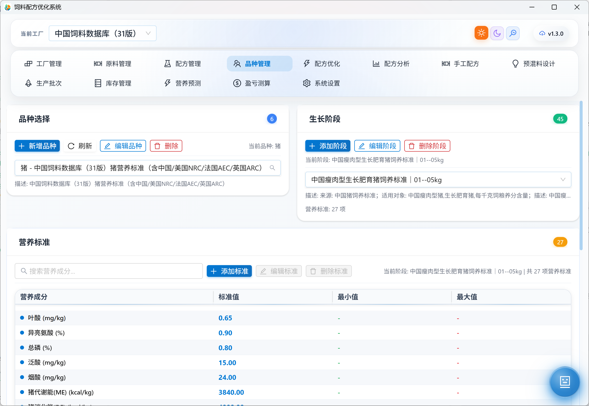

> 截图解读：品种管理是“配方目标”的来源。新人常常先会做配方，再回头补标准；实际培训时应该反过来，先把品种和标准讲清楚。

#### 快速流程图

```mermaid
flowchart LR
    A["新增品种"] --> B["新增生长阶段"]
    B --> C["维护各阶段营养标准"]
    C --> D["保存并复核最小值 / 标准值 / 最大值"]
    D --> E["供配方优化 / 预混料设计引用"]
```

#### 适用场景

1. 新增动物品种。
2. 为某品种补充新的生长阶段。
3. 维护不同阶段的营养最小值、标准值和最大值。

#### 页面重点

1. 品种列表。
2. 生长阶段管理。
3. 营养标准维护。

#### 如何使用

1. 先新增品种。
2. 在品种下新增生长阶段。
3. 进入阶段详情，为营养指标维护最小值、标准值、最大值。
4. 保存后，到“配方优化”或“预混料设计”验证能否正常导入标准。

#### 常见提醒

1. 阶段命名要清楚，例如仔猪前期、中期、后期，不要含糊。
2. 营养标准不完整时，优化结果往往会偏离预期。

### 4.4 配方管理

> 截图解读：配方管理是配方库的“台账中心”。培训新人时要强调，生产、分析、优化都不是直接围绕“名称”展开，而是围绕“配方号 + 版本”展开。

#### 快速流程图

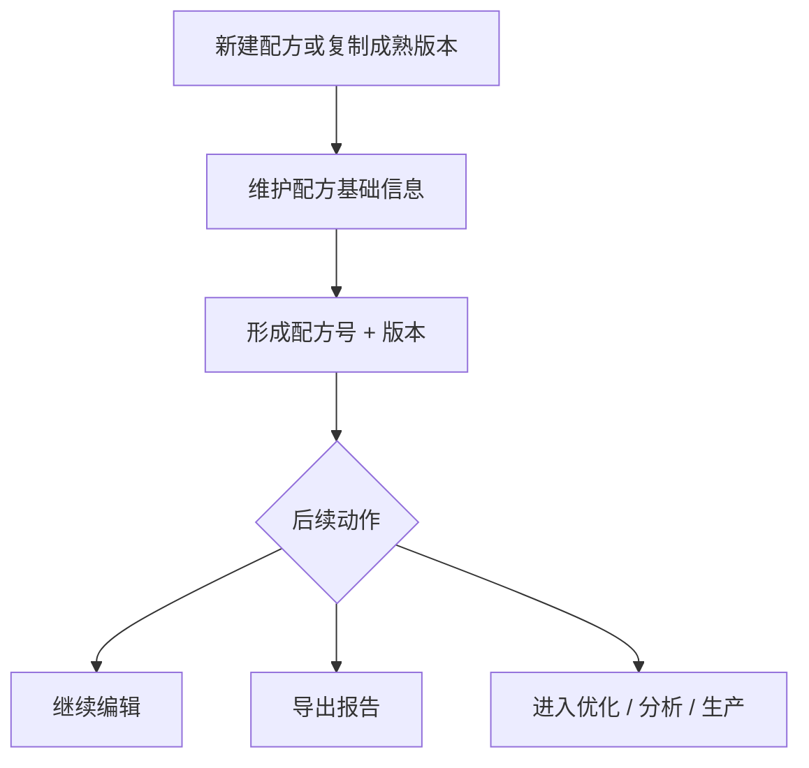
```mermaid
flowchart TD
    A["新建配方或复制成熟版本"] --> B["维护配方基础信息"]
    B --> C["形成配方号 + 版本"]
    C --> D{"后续动作"}
    D --> E["继续编辑"]
    D --> F["导出报告"]
    D --> G["进入优化 / 分析 / 生产"]
```

#### 适用场景

1. 新建正式配方。
2. 复制现有配方作为新版起点。
3. 管理多版本配方。
4. 导出配方或分析报告。

#### 页面重点

1. 配方列表与版本信息。
2. 新建、复制、编辑、删除。
3. 单个、多选、批量导出。

#### 如何使用

1. 新建时，优先采用统一的配方号命名规则。
2. 复制配方时，把成熟版本作为基础，而不是从零重做。
3. 编辑前确认当前要改的是哪一个版本。
4. 导出时根据场景选择导出单个、多个或全部。

#### 常见提醒

1. 重要变更尽量保存为新版本，不建议直接覆盖已经在生产使用的版本。
2. 删除前先确认该版本是否被生产批次或分析流程引用。

### 4.5 配方优化

> 截图解读：配方优化页面通常用于“自动求解”。培训时要让新人理解，系统只是在约束条件下找最优解，所以结果质量高度依赖约束设置质量。

#### 快速流程图

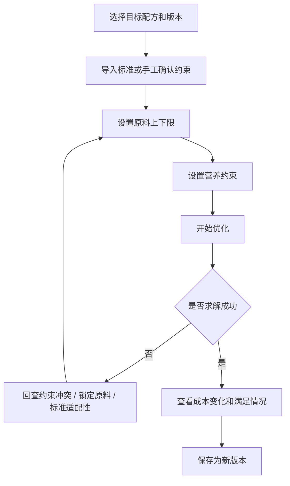
```mermaid
flowchart TD
    A["选择目标配方和版本"] --> B["导入标准或手工确认约束"]
    B --> C["设置原料上下限"]
    C --> D["设置营养约束"]
    D --> E["开始优化"]
    E --> F{"是否求解成功"}
    F -- "否" --> G["回查约束冲突 / 锁定原料 / 标准适配性"]
    G --> C
    F -- "是" --> H["查看成本变化和满足情况"]
    H --> I["保存为新版本"]
```

#### 适用场景

1. 以最低成本满足营养需求。
2. 替换高价原料。
3. 生成某个成熟配方的改良版。

#### 页面重点

1. 目标配方与版本选择。
2. 标准导入。
3. 原料约束设置。
4. 营养约束设置。
5. 结果解读和保存。

#### 如何使用

1. 选择优化对象。
2. 如有标准，优先导入标准。
3. 为原料设置是否参与优化、最小值、最大值。
4. 为营养指标设置最小值、目标值、最大值。
5. 点击开始优化，观察系统状态提示。
6. 重点看成本变化、约束满足情况和求解状态。
7. 结果合适后，保存为新版本或新配方。

#### 优化失败时先看什么

1. 约束是否过严。
2. 最小值与最大值是否冲突。
3. 某些关键原料是否被锁死。
4. 导入的品种标准是否与当前配方场景一致。

#### 常见提醒

1. 优化结果不是终点，必须再做分析和盈亏复核。
2. 培训新人时，建议先从“复制成熟配方后做小范围优化”开始。

### 4.6 配方分析

> 截图解读：配方分析更像“解释层”。如果配方优化负责“算答案”，配方分析负责“告诉你答案为什么这样、与旧版本差在哪里”。

#### 快速流程图

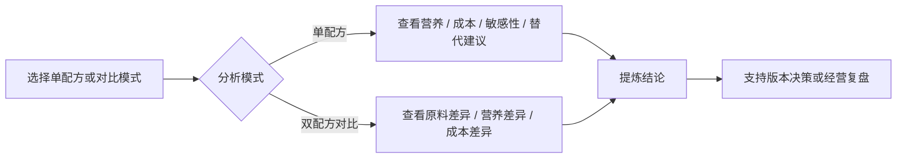
```mermaid
flowchart LR
    A["选择单配方或对比模式"] --> B{"分析模式"}
    B -- "单配方" --> C["查看营养 / 成本 / 敏感性 / 替代建议"]
    B -- "双配方对比" --> D["查看原料差异 / 营养差异 / 成本差异"]
    C --> E["提炼结论"]
    D --> E
    E --> F["支持版本决策或经营复盘"]
```

#### 适用场景

1. 想深度理解单个配方。
2. 想比较两个版本或两个配方。
3. 想查看成本敏感性和替代方向。

#### 页面重点

1. 单配方深度分析。
2. 双配方对比分析。
3. 成本趋势、原料敏感性、可替代原料、AI 建议。

#### A. 单配方深度分析

##### 适用场景

1. 复盘某个正式版本是否合理。
2. 向经营层解释为什么这个配方成本偏高。

##### 如何使用

1. 选择配方与版本。
2. 查看营养构成、成本趋势、敏感性、替代建议。
3. 把重点结论带到“盈亏测算”或 AI 助手中继续讨论。

#### B. 配方对比分析

##### 适用场景

1. 比较新旧版本。
2. 比较两个不同产品方案。

##### 如何使用

1. 进入对比模式。
2. 选择基础配方与对比配方及其版本。
3. 查看原料变化、营养差异和成本差异。
4. 用结果支持版本决策。

#### 常见提醒

1. 不要拿同一个配方的同一版本做对比。
2. 对比分析特别适合培训新人理解“一个版本更新到底改了什么”。

### 4.7 手工配方

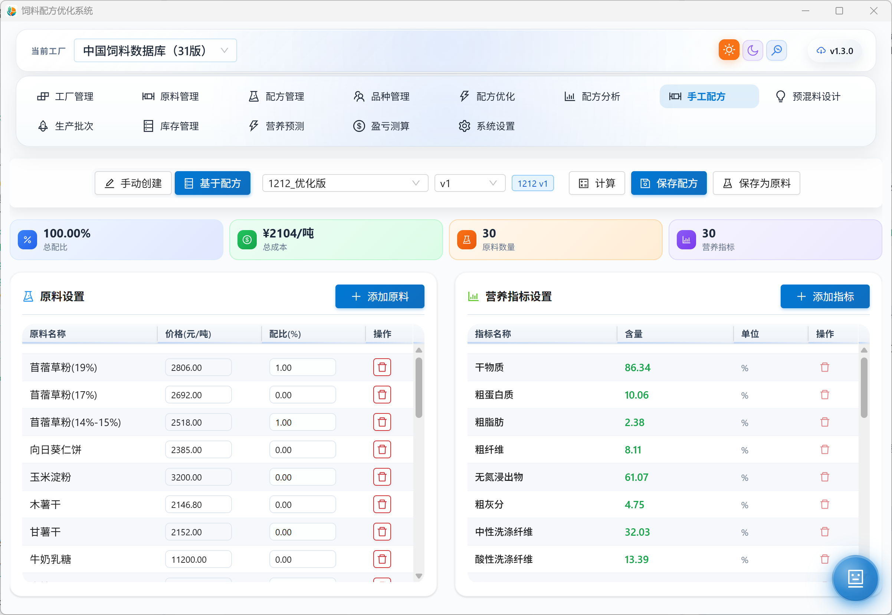

> 截图解读：手工配方适合经验型调配和试验性工作。它并不替代配方优化，而是给人工试配、快速试验和复杂经验判断留出空间。

#### 快速流程图

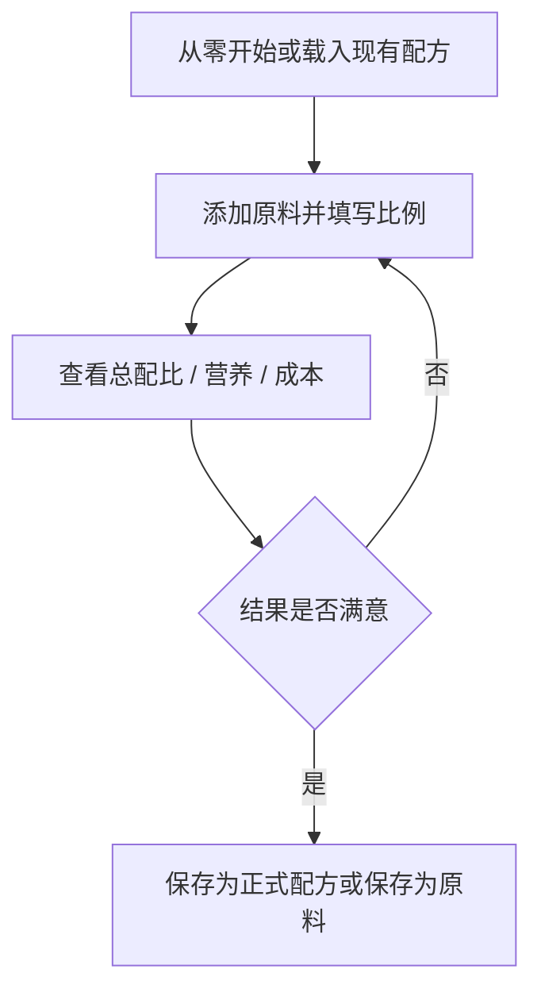
```mermaid
flowchart TD
    A["从零开始或载入现有配方"] --> B["添加原料并填写比例"]
    B --> C["查看总配比 / 营养 / 成本"]
    C --> D{"结果是否满意"}
    D -- "否" --> B
    D -- "是" --> E["保存为正式配方或保存为原料"]
```

#### 适用场景

1. 经验型调方。
2. 小试、中试、临时试验方案。
3. 希望把手工方案保存为正式配方或复合原料。

#### 页面重点

1. 从零开始建立手工配方。
2. 基于现有配方载入并修改。
3. 计算营养和成本。
4. 保存为配方或保存为原料。

#### 如何使用

1. 先选择工厂。
2. 新建手工配方，或从现有配方版本载入。
3. 添加原料并输入比例。
4. 观察总配比是否合理、营养指标是否满足目标。
5. 完成后选择保存为正式配方，或保存为新原料。

#### 常见提醒

1. 手工配方没有任何原料项时无法保存。
2. 总配比、关键营养指标、原料逻辑要在保存前人工复核一次。

### 4.8 预混料设计

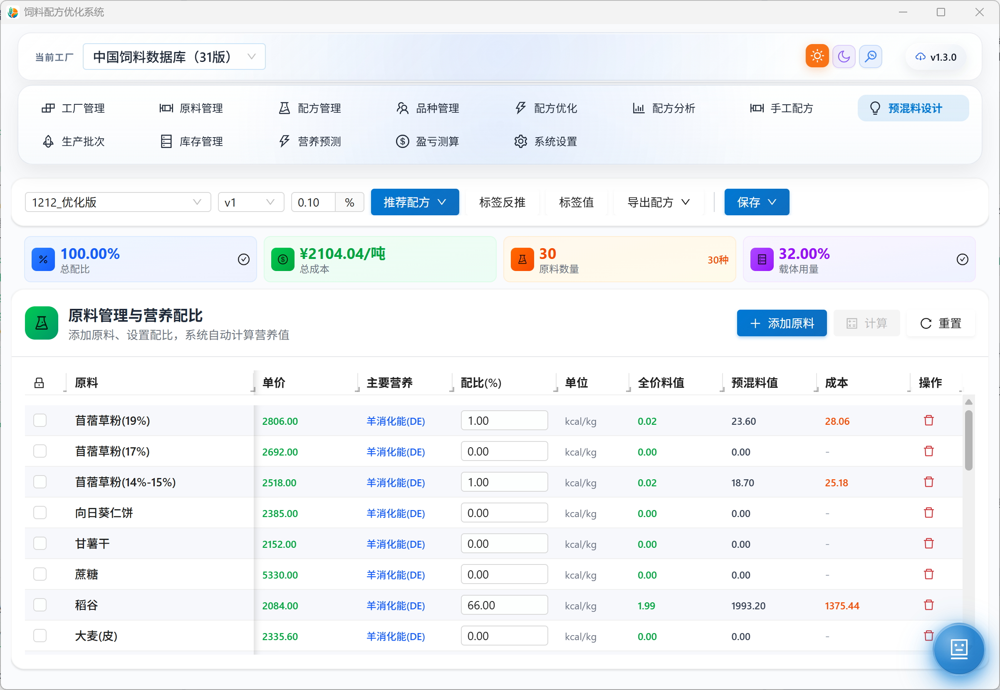

> 截图解读：预混料设计页面把“营养目标、原料配比、成本、推荐配方”放在同一套工作流里，适合做培训中的“高阶模块”。

#### 快速流程图

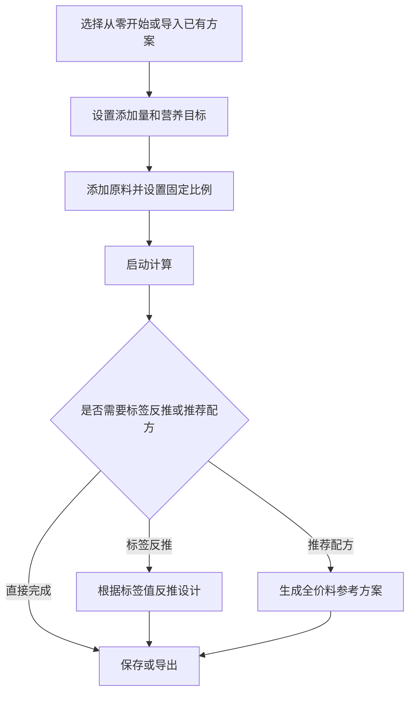
```mermaid
flowchart TD
    A["选择从零开始或导入已有方案"] --> B["设置添加量和营养目标"]
    B --> C["添加原料并设置固定比例"]
    C --> D["启动计算"]
    D --> E{"是否需要标签反推或推荐配方"}
    E -- "标签反推" --> F["根据标签值反推设计"]
    E -- "推荐配方" --> G["生成全价料参考方案"]
    E -- "直接完成" --> H["保存或导出"]
    F --> H
    G --> H
```

#### 适用场景

1. 设计维生素、微量元素或复合预混料。
2. 把历史预混料配方导入后重新计算。
3. 根据标签值反推设计。

#### 页面重点

1. 添加量设置。
2. 营养目标输入。
3. 原料管理与固定配比。
4. 计算结果、标签反推、推荐配方。

#### 如何使用

1. 选择从零开始或导入已有配方。
2. 设置添加量，准备营养需求。
3. 添加原料，必要时锁定固定比例。
4. 启动计算，查看配比、营养贡献和成本。
5. 如需全价料参考，使用“生成推荐配方”。
6. 保存为预混料配方、保存为原料或导出报告。

#### 常见提醒

1. 添加量必须明确，否则后续标签和推荐配方都不稳。
2. 若用标签反推，先核对标签指标和单位是否一致。

### 4.9 营养预测

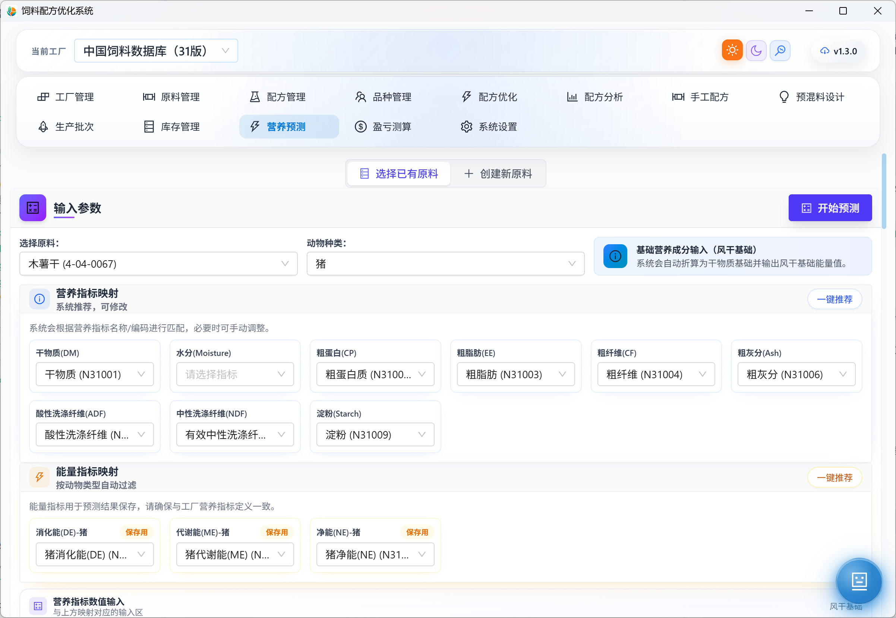

> 截图解读：营养预测适合做“先估值、后修正”。它不是实验室检测的替代品，但非常适合在缺少能量值时先让系统可运转。

#### 快速流程图

```mermaid
flowchart LR
    A["选择已有原料或新建原料模式"] --> B["选择动物类别"]
    B --> C["检查营养与能量映射"]
    C --> D["输入营养值"]
    D --> E["开始预测"]
    E --> F["选择平均值或指定公式结果"]
    F --> G["写回原料或另存为新原料"]
```

#### 适用场景

1. 已有原料缺少能量值。
2. 新原料还没做完检测。
3. 想把预测结果直接写回数据库。

#### 页面重点

1. 选择已有原料或新建原料模式。
2. 动物类别选择。
3. 营养指标映射与能量指标映射。
4. 预测结果保存方式。

#### 如何使用

1. 选择输入模式。
2. 选择原料或录入新原料信息。
3. 选择动物类别。
4. 检查营养和能量映射。
5. 输入营养值并开始预测。
6. 选择平均值或指定公式结果写入数据库。

#### 常见提醒

1. 干物质通常是关键输入项。
2. 如果能量指标没有映射好，预测结果可能无法写回原料。

### 4.10 盈亏测算

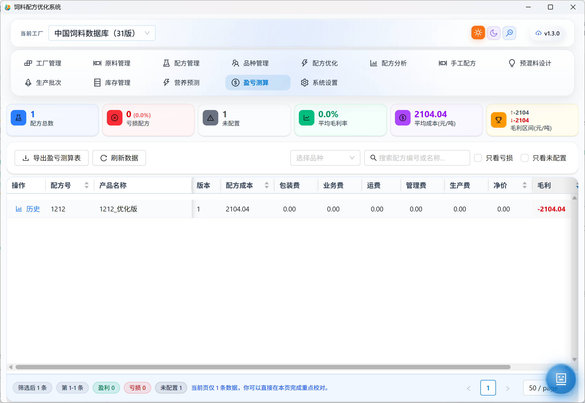

> 截图解读：盈亏测算是把“配方好不好”转成“生意做不做得过来”。培训经营、采购、财务人员时，这个页面通常最有说服力。

#### 快速流程图

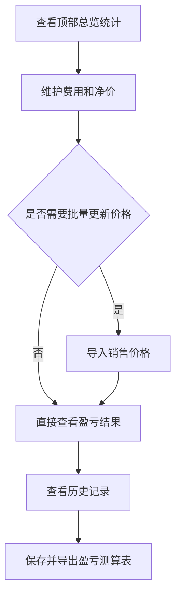
```mermaid
flowchart TD
    A["查看顶部总览统计"] --> B["维护费用和净价"]
    B --> C{"是否需要批量更新价格"}
    C -- "是" --> D["导入销售价格"]
    C -- "否" --> E["直接查看盈亏结果"]
    D --> E
    E --> F["查看历史记录"]
    F --> G["保存并导出盈亏测算表"]
```

#### 适用场景

1. 判断当前产品是否赚钱。
2. 评估原料价格变化对利润的影响。
3. 排查亏损配方和未配置配方。

#### 页面重点

1. 顶部总览统计。
2. 配方成本、费用、净价、毛利、利润率。
3. 销售价格导入。
4. 历史查看。
5. 批量保存与导出。

#### 如何使用

1. 进入页面后先看顶部统计卡片。
2. 在表格中直接维护包装费、业务费、运费、管理费、生产费、净价。
3. 需要批量更新时，使用销售价格导入。
4. 通过“历史”按钮查看成本历史、盈亏历史和原料价格历史。
5. 确认数据后保存更改，并按需导出盈亏测算表。

#### 常见提醒

1. 盈亏测算前最好先更新原料价格。
2. “未配置”通常意味着费用项或净价项还不完整。

### 4.11 生产批次

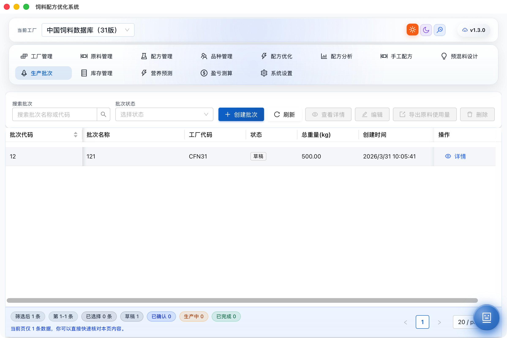

> 截图解读：这个页面是“把配方版本正式变成生产任务”的入口。顶部先筛选批次，再执行创建、查看、编辑、导出；列表底部会同步显示草稿、已确认、生产中、已完成各状态数量，方便班组长或管理人员快速盘点。

#### 快速流程图

```mermaid
flowchart LR
    A["确认要投产的配方版本"] --> B["创建批次"]
    B --> C["添加配方并填写生产重量"]
    C --> D["查看详情复核原料需求"]
    D --> E["更新批次状态"]
    E --> F["导出原料使用量"]
    F --> G["进入库存管理继续执行"]
```

#### 适用场景

1. 已经确定某个配方版本要投产。
2. 需要按批次汇总原料需求。
3. 想把研发版本正式落到生产。
4. 需要让仓库、生产、计划三方围绕同一个批次编号协同。

#### 页面重点

1. 批次搜索和状态筛选。
2. 创建生产批次。
3. 编辑批次基础信息和状态。
4. 查看批次详情、配方明细和原料需求清单。
5. 导出原料使用量 Excel。

#### 如何使用

1. 进入页面后，先确认左上角当前工厂，再用“搜索批次”和“批次状态”快速定位目标批次。
2. 新建时点击“创建批次”，填写批次代码、批次名称和备注。
3. 在“配方列表”中点击“添加配方”，从当前工厂的配方库中选择要投产的配方。
4. 为每个配方确认版本并填写生产重量。这里的版本和重量是后续原料需求计算的基础，不能为空，重量必须大于 0。
5. 点击“创建”后，批次会进入列表；通常建议先以“草稿”开始，待计划确认后再调整为“已确认”。
6. 需要复核时，单击行可选中批次，点击“查看详情”可看到三块内容：基本信息、配方列表、原料需求清单。
7. 生产推进过程中，可选中一个批次点击“编辑”，更新批次名称、状态、备注和配方组合。当前状态包括：草稿、已确认、生产中、已完成。
8. 需要把原料需求发给仓库或现场时，选中一个批次后点击“导出原料使用量”；详情弹窗里的“导出Excel”也是同一用途。

#### 推荐操作流程

1. 配方在“配方管理”中确认版本。
2. 到“生产批次”创建批次并补齐每个配方的生产重量。
3. 在详情里复核总重量、配方版本和原料需求。
4. 将状态从“草稿”推进到“已确认”或“生产中”。
5. 再进入“库存管理”记录领用、投料和剩余。

#### 常见提醒

1. 一个批次里最关键的是“配方版本”和“生产重量”，这两项一错，后面的原料需求、库存核对都会跟着错。
2. 当前顶部“导出原料使用量”实际按单个批次导出使用，若一次选中多个批次，系统会提示改为单批次导出。
3. 编辑和查看详情都要求只选中一个批次；如果按钮是灰的，通常是因为没有选中或一次选中了多个批次。
4. 创建批次后，建议立即进入“库存管理”完成库存记录，这样生产与仓库数据能衔接起来。

### 4.12 库存管理

> 说明：左侧菜单名称为“库存管理”，页面标题为“原料库存管理”。培训时请把这两个名称对应起来，避免新人误以为是两个页面。

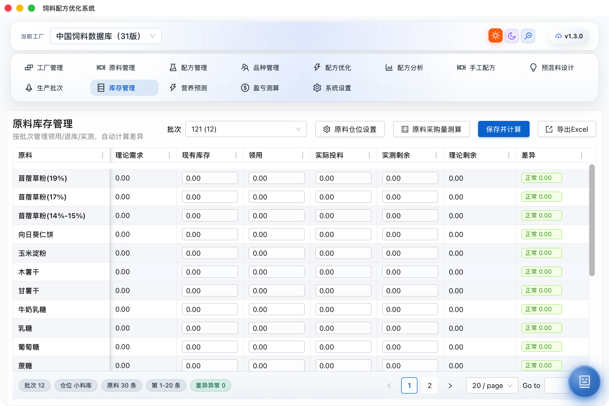

> 截图解读：这个页面一半是“批次库存核对”，一半是“仓位采购测算”。主表围绕批次管理理论需求、领用、投料和差异；右侧抽屉则围绕仓位管理库存天数和采购量。

#### 快速流程图

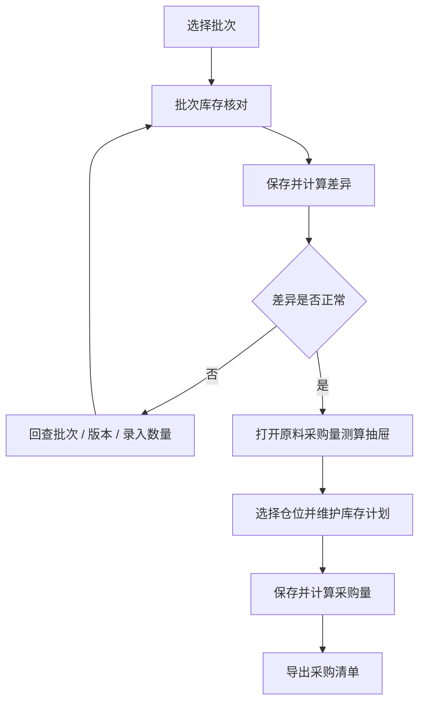
```mermaid
flowchart TD
    A["选择批次"] --> B["批次库存核对"]
    B --> C["保存并计算差异"]
    C --> D{"差异是否正常"}
    D -- "否" --> E["回查批次 / 版本 / 录入数量"]
    E --> B
    D -- "是" --> F["打开原料采购量测算抽屉"]
    F --> G["选择仓位并维护库存计划"]
    G --> H["保存并计算采购量"]
    H --> I["导出采购清单"]
```

#### 适用场景

1. 记录批次理论需求、领用、投料和剩余。
2. 按仓位测算采购量。
3. 为原料配置所属仓位。

#### 页面重点

1. 批次库存核对。
2. 原料采购量测算。
3. 原料仓位设置。
4. 保存并计算。

#### A. 批次库存核对

##### 适用场景

1. 已创建生产批次，需要核对耗料。
2. 想看某批次是多用料还是少用料。
3. 想快速找出库存差异异常的原料。

##### 如何使用

1. 进入页面后先确认当前工厂，再从顶部“批次”下拉框选择目标批次。
2. 系统会加载该批次的原料库存表，主表核心列包括：理论需求、现有库存、领用、实际投料、实测剩余、理论剩余、差异。
3. 按现场记录逐项填写或修正现有库存、领用、实际投料、实测剩余。
4. 点击“保存并计算”后，系统会回写库存并重新计算差异；底部摘要区会显示当前批次、当前仓位、原料条数以及“差异异常”数量。
5. 如需归档或发给其他部门，可点击“导出Excel”导出当前批次库存表。

##### 这几列怎么理解

1. 理论需求：来自生产批次和配方版本的理论耗料量。
2. 现有库存：本次核对前该原料的库存起点。
3. 领用：从仓库领出的数量。
4. 实际投料：实际投入生产的数量。
5. 实测剩余：现场盘点得到的剩余量。
6. 理论剩余与差异：用于判断账面与现场是否一致，差异不为 0 时要重点复核。

##### 培训提醒

1. 差异异常时，先检查是否选错批次、版本或录错数量，不要一上来就怀疑系统计算。
2. 生产、仓库、财务三方最好统一口径后再录入，否则同一批次会出现“各自都对、放一起不对”的情况。
3. 如果页面提示“未选择批次”或“该批次暂无库存数据”，先回到顶部确认批次是否已创建并正确选中。

#### B. 原料采购量测算

##### 适用场景

1. 想按仓位看哪些原料该采购。
2. 想估算当前库存还能支撑多少天。
3. 想把采购建议按仓位导出给采购或仓库。

##### 如何使用

1. 点击顶部“原料采购量测算”，页面会从右侧打开“采购量测算”抽屉。
2. 在抽屉顶部先选择仓位，例如大料库、小料库或自定义仓位。
3. 逐项维护该仓位下原料的现有库存、月用量、标准库存天数。
4. 点击抽屉里的“保存并计算”，系统会先保存库存计划，再同步仓位库存，并自动算出可用天数和需采购量。
5. 重点看两列：
   可用天数：按当前库存还能支撑多少天；
   需采购量：为达到目标库存天数，还需要补多少。
6. 计算结果确认后，点击抽屉里的“导出Excel”，形成仓位维度的采购清单。

##### 培训提醒

1. 没有点“保存并计算”前，导出的结果可能不是最新的。
2. 采购测算的准确性高度依赖月用量、标准天数和仓位归属是否真实。
3. 主页面的“导出Excel”和抽屉里的“导出Excel”不是同一份表：前者偏批次库存，后者偏仓位采购计划。

#### C. 原料仓位设置

##### 适用场景

1. 新工厂刚启用，仓位还没整理。
2. 原料分仓规则发生变化。

##### 如何使用

1. 打开“原料仓位设置”。
2. 查看每个原料的“推荐仓位”和“当前仓位”。
3. 系统会基于月用量做基础推荐：
   大用量原料倾向大料库；
   小用量原料倾向小料库；
   中等用量原料倾向其他原料库。
4. 根据现场实际调整“当前仓位”；如果现有选项不够，可点击“新增仓位”创建自定义仓位。
5. 点击“确定”后，系统会批量保存全部原料的仓位设置，再回到采购测算抽屉继续计算。

##### 培训提醒

1. 仓位推荐只是系统建议，不是最终规则。
2. 新增仓位只有在给原料分配并保存后才会真正持久化到系统。
3. 没有完成仓位设置时，采购量汇总会不准。

### 4.13 AI 智能助手

> 截图解读：AI 助手不是替你做业务决策，而是帮你更快理解当前页面数据、解释异常、整理结论。最好的使用方式是“带着上下文提问”。

#### 快速流程图

```mermaid
flowchart LR
    A["先选工厂和业务对象"] --> B["打开右下角 AI 助手"]
    B --> C["使用快捷提问或自然语言提问"]
    C --> D["获取解释 / 排障建议 / 汇报话术"]
    D --> E["回到业务页面核实并落地"]
```

#### 适用场景

1. 新人看不懂页面结果。
2. 想快速解释优化结果、库存差异、利润变化。
3. 想把复杂结果转成便于沟通的结论。

#### 使用前准备

1. 在“系统设置”中选择 AI 服务商。
2. 填写 API 密钥。
3. 选择模型。
4. 测试连接成功。

#### 如何使用

1. 先切到目标业务页面，并选中目标对象。
2. 点击右下角浮动按钮打开 AI 助手。
3. 优先使用快捷提问；如需更细，直接输入自然语言问题。
4. 需要重新开始时，新建会话。
5. 历史会话可以在会话管理中查看、删除或清空。

#### 推荐提问模板

1. 这个配方版本和上一版本的主要差异是什么？
2. 当前配方优化为什么无解？请按约束冲突来解释。
3. 这个批次的库存差异可能来自哪些环节？
4. 这个配方利润率偏低，优先应检查哪些原料或费用？
5. 请把当前页面结果整理成一段给领导汇报的话。

#### 常见提醒

1. AI 回答前先选工厂、再选对象，准确率会高很多。
2. AI 适合辅助解释，不应替代最终业务判断。

### 4.14 系统设置与更新

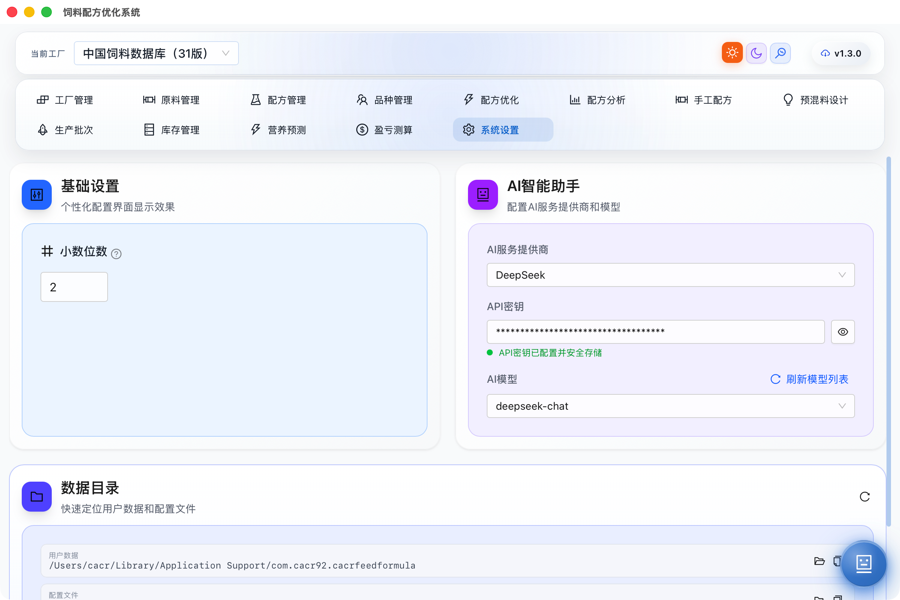

> 截图解读：系统设置页分成三块最常用区域：左侧基础设置，中间 AI 智能助手配置，底部/右侧数据目录。培训新人时建议强调这不是“管理员专属页”，很多一线问题也要先来这里排查。

#### 快速排查流程图

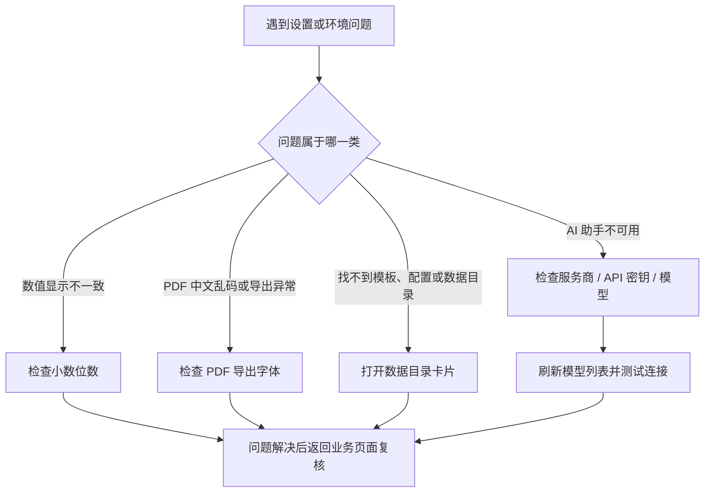
```mermaid
flowchart TD
    A["遇到设置或环境问题"] --> B{"问题属于哪一类"}
    B -- "数值显示不一致" --> C["检查小数位数"]
    B -- "PDF 中文乱码或导出异常" --> D["检查 PDF 导出字体"]
    B -- "AI 助手不可用" --> E["检查服务商 / API 密钥 / 模型"]
    B -- "找不到模板、配置或数据目录" --> F["打开数据目录卡片"]
    E --> G["刷新模型列表并测试连接"]
    C --> H["问题解决后返回业务页面复核"]
    D --> H
    F --> H
    G --> H
```

#### 适用场景

1. 第一次部署系统。
2. 新电脑第一次使用。
3. PDF 导出异常、AI 连接失败、显示位数不统一、需要查看模板目录。

#### 页面重点

1. 小数位数。
2. PDF 导出字体。
3. AI 智能助手配置。
4. 数据目录、配置目录、模板目录的打开与复制。
5. 顶部主题切换和版本更新。

#### A. 系统设置页面

##### 适用场景

1. 统一团队显示口径。
2. 解决 PDF 中文字体问题。
3. 启用 AI。
4. 查找模板和数据目录。

##### 如何使用

1. 在基础设置中配置小数位数。该设置会立即保存并影响全系统数值显示，适合统一团队查看口径。
2. 在 PDF 字体区域选择本机可用字体，优先选择可正常显示中文的字体。
3. 在 AI 智能助手区域依次完成：
   选择服务商；
   填写 API 密钥；
   刷新模型列表；
   选择模型。
4. 如果切换服务商，系统会优先尝试自动回填该服务商最近使用过的配置；若没有历史配置，会提示重新填写密钥和模型。
5. 在数据目录区域查看“用户数据”“配置文件”“模板目录”三类路径；每项都支持刷新、打开所在目录和复制路径。

##### 推荐排查顺序

1. 页面数字显示不一致：先看小数位数。
2. PDF 导出中文乱码或字体异常：先换 PDF 导出字体。
3. AI 助手不能用：先查服务商、密钥、模型，再测试连接。
4. 找不到导入模板、数据库或配置文件：直接来“数据目录”卡片打开对应目录。

##### 培训提醒

1. PDF 中文乱码时，第一优先检查字体设置。
2. AI 模型列表刷新前必须先有可用 API 密钥，否则系统会提示先配置密钥。
3. 目录卡片里的“打开”适合快速定位文件，“复制”适合发给同事或贴到排障信息里。
4. AI 连接异常时，先查服务商、密钥、模型和网络。

#### B. 顶部主题切换

##### 适用场景

1. 不同用户有不同阅读习惯。
2. 深色环境或大屏展示时需要切换主题。

##### 如何使用

1. 使用顶部按钮切换浅色、深色或跟随系统。

#### C. 顶部版本与更新

##### 适用场景

1. 想确认当前版本。
2. 需要检查并安装新版本。

##### 如何使用

1. 点击顶部更新入口。
2. 先执行检查更新。
3. 有新版本时下载并安装。
4. 安装完成后点击“立即重启应用”使更新生效。

##### 培训提醒

1. 建议管理员先验证新版本，再组织现场统一更新。

---

## 5. 常见问题与排障建议

### 5.1 为什么很多页面是空的

先检查顶部当前工厂是否正确。  
系统的大多数业务页面都依赖当前工厂，没有选工厂时，很多页面会显示空态提示。

### 5.2 为什么找不到某个营养指标

优先检查：

1. 原料管理里的营养定义是否已经维护。
2. 编码、名称、单位是否统一。
3. 当前工厂下是否存在该营养定义。

### 5.3 为什么配方优化无解

优先检查：

1. 原料上下限是否冲突。
2. 营养上下限是否过严。
3. 导入标准是否适用于当前品种和阶段。
4. 某些关键原料是否被固定死了。

### 5.4 为什么导入成功了，后面模块还是匹配不上

大多数情况是编码体系不一致。  
重点检查原料编码、配方编码、营养指标编码是否统一。

### 5.5 为什么预混料保存失败

优先检查：

1. 当前工厂是否已选择。
2. 是否已经完成计算。
3. 是否存在有效的原料配比。
4. 添加量是否大于 0。

### 5.6 为什么库存采购量算不出来

优先检查：

1. 是否已完成原料仓位设置。
2. 是否选择了仓位。
3. 是否填写了月用量和标准库存天数。
4. 是否点击了“保存并计算”。

### 5.7 为什么 AI 助手不能用

优先检查：

1. 系统设置里是否已配置服务商、API 密钥、模型。
2. 连接测试是否通过。
3. 当前网络是否可访问对应 AI 服务。

### 5.8 为什么 PDF 导出中文显示异常

进入“系统设置”，重新选择 PDF 导出字体后再导出。  
建议在每台新电脑上第一次使用时先做一次 PDF 测试导出。

### 5.9 新人最容易犯的 5 个错误

1. 忘了切换当前工厂就开始录数据。
2. 原料编码、营养编码命名不统一。
3. 直接覆盖正式版本，而不是另存为新版本。
4. 做完优化不去做分析和盈亏复核。
5. 做采购测算前没有先做仓位设置和保存并计算。
